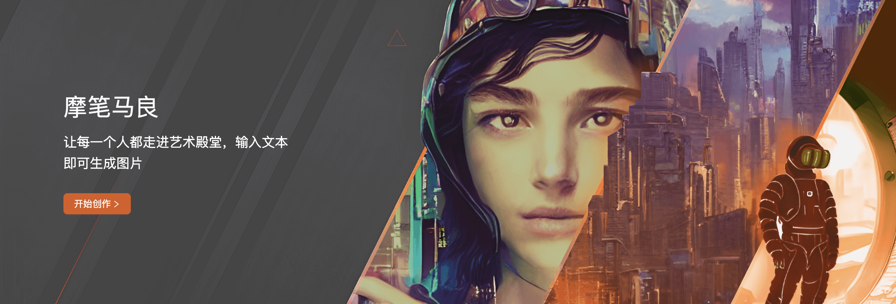

<p align="center">
  
</p> 

---
<!-- tocstop -->

<!-- vscode-markdown-toc -->
## 目录
1. [安装步骤](#install)
2. [模型下载](#models)
3. [快速上手](#quick_start)
4. [线上摩笔马良](#online_service)

<!-- vscode-markdown-toc-config
	numbering=true
	autoSave=true
	/vscode-markdown-toc-config -->
<!-- /vscode-markdown-toc -->

##  1. <a name='install'></a>安装步骤

### 1.1. 克隆项目

安装好 Ubuntu20.04 之后，在桌面点击鼠标右键，选择 `New Folder` 新建文件夹，命名为 `mtai_workspace`，双击文件夹进入

再次点击右键，选择 `Open in Terminal` 打开命令行，可以看到此时命令行前缀为：`~/Desktop/mtai_workspace$` （如果系统语言为中文，则为 `~/桌面/mtai_workspace$`，下同）

输入以下命令并回车，将会克隆项目并进入项目文件夹，此时命令行前缀变为：`~/Desktop/mtai_workspace/MobiMaliangSDK$`

```
git clone https://github.com/MooreThreads/MobiMaliangSDK;cd MobiMaliangSDK
```
### 1.2. 安装驱动

输入以下命令，将会安装驱动 `musa_2.1.1-Ubuntu-dev_amd64.deb`

```
sudo bash install_driver.sh
```

如果sudo要求输入用户密码则请输入；如果出现 `Configuring lightdm` 的UI，请将 `Default display manager` 选成 `lightdm`

如果看到类似以下的驱动信息，则说明驱动安装成功；如果显示器分辨率没有变得更大，最好重启以确保驱动生效

```
Package: musa
Status: install ok installed
Priority: optional
Section: graphics
Installed-Size: 258062
Maintainer: Moore Threads
Architecture: amd64
Version: 2.1.1-Ubuntu-dev
Replaces: mtsnd, mtgpu, musa-wine, musa_all-in-one, linux-firmware
Depends: libdrm2 (>= 2.4.99), lightdm, dkms
Conflicts: mtsnd, mtgpu, musa-wine, musa_all-in-one
Description: Moore Threads MUSA driver
Homepage: https://developer.mthreads.com/
```
### 1.3. 开发者账号

请向 `developers@mthreads.com` 发送邮件，提供姓名、手机号、行业等基本信息，以申请开发者账号，用于拉取运行 `torch_musa` 所需的镜像

申请成功后，请编辑 `install.sh` [第19行](https://github.com/MooreThreads/MobiMaliangSDK/blob/main/install.sh#L19)，并替换`账号`和`密码`

如果系统语言为中文，则编辑 `install_ch.sh` [第19行](https://github.com/MooreThreads/MobiMaliangSDK/blob/main/install_cn.sh#L19)

### 1.4. 其他安装

如果重启了，请打开 `MobiMaliangSDK` 文件夹，点击右键，选择 `Open in Terminal`，以重新进入命令行，前缀为：`~/Desktop/mtai_workspace/MobiMaliangSDK$`

输入以下命令，以完成后续安装

```
sudo bash install.sh
```

如果系统语言为中文，即命令行中 `Desktop` 显示为 `桌面` ，则运行 `sudo bash install_cn.sh`

以上安装文件将依次完成以下内容：

- 下载 [sgpu-dkms](https://mcconline.oss-cn-beijing.aliyuncs.com/software/2023/07/11/sgpu-dkms_1.1.1.deb)、[mtml](https://mcconline.oss-cn-beijing.aliyuncs.com/software/2023/07/11/mtml_1.5.0.deb)、[container toolkit](https://mcconline.oss-cn-beijing.aliyuncs.com/software/2023/07/11/mt-container-toolkit_1.5.0.deb) 并安装

```bash
sudo dpkg -i mtml_1.5.0.deb sgpu-dkms_1.1.1.deb mt-container-toolkit_1.5.0.deb
(cd /usr/bin/musa && sudo ./docker setup $PWD)
```
> 具体参考 [摩尔线程容器运行时套件](https://mcconline.mthreads.com/software/1?id=1)

- 登录 docker
```bash
docker login -u 账号 -p 密码 registry.mthreads.com
```
如未有账号，可以向 `developers@mthreads.com` 发送申请邮件

- 拉取 docker 镜像 registry.mthreads.com/mcconline/musa-pytorch-release-public:latest
```bash
sudo docker pull registry.mthreads.com/mcconline/musa-pytorch-release-public:latest
```

- 创建容器 `mtai_workspace`并进入
```bash
docker run -id --name mtai_workspace --privileged -e MTHREADS_VISIBLE_DEVICES=all -p 1001:1001 -p 1002:1002 -p 1003:1003 -p 1004:1004 -p 1005:1005 -v ~/Desktop/mtai_workspace:/mtai_workspace:rw --shm-size 64G registry.mthreads.com/mcconline/musa-pytorch-release-public:v1.0.0
docker exec -it mtai_workspace /bin/bash
```

此时命令行前缀变成类似 `(py38) root@xxxx`，说明已经进入容器了，运行以下三行命令，完成安装，其中第一行进入到项目目录，第二行安装容器系统依赖，第三行安装项目依赖

```
cd /mtai_workspace/MobiMaliangSDK/
apt-get update && apt-get install ffmpeg libsm6 libxext6 -y
pip install -r requirements.txt --no-deps
```
### 1.5. 启动 WebUI

如果在容器外面，确认命令行前缀为：`~/Desktop/mtai_workspace/MobiMaliangSDK$`，输入以下命令以进入容器

```
sudo docker exec -it mtai_workspace /bin/bash
```

如果已经在容器里了，输入以下命令，其中第一行进入到项目目录，第二行启动 WebUI 服务

```
cd /mtai_workspace/MobiMaliangSDK/
streamlit run frontend/main.py --server.port 1001
```

在浏览器地址中输入，`localhost:1001` 即可访问 WebUI，也可右键点击命令行中的 `Network URL` 并选择 `Open Link`

如果要停止 WebUI 服务，按 `Ctrl + C` 即可；停止服务后，如果要退出容器，输入 `exit` 即可

### 1.6. 常用 docker 命令

- `sudo docker images -a`：查看全部已下载的镜像
- `sudo docker ps -a`：查看全部容器
- `sudo docker start container_name`：启动名为 `container_name` 的容器
- `sudo docker stop container_name`：停止名为 `container_name` 的容器

##  2. <a name='models'></a>模型下载
- Stable Diffusion: 生图底模，ckpt和safetensors皆可，可从tusiart.com、civitai.com等网站下载，例如[GhostMix2.0](https://tusiart.com/models/601380436024757697)，下载后放至`models/Stable-diffusion/`
- Controlnet: 
  - [canny](https://huggingface.co/lllyasviel/control_v11p_sd15_canny/blob/main/diffusion_pytorch_model.fp16.safetensors)：实现ControlNet边缘控制生成，下载后放至`models/controlnet/canny_v11/`，并命名为`diffusion_pytorch_model.safetensors`
  - [openpose](https://huggingface.co/lllyasviel/control_v11p_sd15_openpose/blob/main/diffusion_pytorch_model.fp16.safetensors)：实现ControlNet骨骼控制生成，下载后放至`models/controlnet/openpose_v11/`，并命名为`diffusion_pytorch_model.safetensors`
  - [tile](https://huggingface.co/lllyasviel/control_v11f1e_sd15_tile/blob/main/diffusion_pytorch_model.bin)：实现ControlNet Tile精绘功能，下载后放至`models/controlnet/tile_v11/`
  - [mlsd](https://huggingface.co/lllyasviel/control_v11p_sd15_mlsd/blob/main/diffusion_pytorch_model.fp16.safetensors)：实现ControlNet边线控制生成，下载后放至`models/controlnet/mlsd_v11/`，并命名为`diffusion_pytorch_model.safetensors`
  - 骨骼检测模型：[body_pose_model.pth](https://huggingface.co/lllyasviel/Annotators/blob/main/body_pose_model.pth)、[facenet.pth](https://huggingface.co/lllyasviel/Annotators/blob/main/facenet.pth)、[hand_pose_model.pth](https://huggingface.co/lllyasviel/Annotators/blob/main/hand_pose_model.pth)，分别实现全身、面部、手部的检测，下载后放至`models/controlnet/annotators/`
  - 边线检测模型：[mlsd_large_512_fp32.pth](https://huggingface.co/lllyasviel/Annotators/blob/main/mlsd_large_512_fp32.pth)，下载后放至`models/controlnet/annotators/`
- LoRA: safetensors格式，可从tusiart.com、civitai.com等网站下载，下载后放至`models/lora/`
- Textural Inversion：pt格式，可从tusi.art、civitai.com等网站下载，下载后放至`models/embeddings/`
- 超分: [RealESRGAN_x4plus](https://github.com/xinntao/Real-ESRGAN)，更多下载链接：[https://huggingface.co/schwgHao/RealESRGAN_x4plus/blob/main/RealESRGAN_x4plus.pth](https://huggingface.co/schwgHao/RealESRGAN_x4plus/blob/main/RealESRGAN_x4plus.pth)，下载后放至`models/tools/`
- 图生文本：[DeepDanbooru](https://github.com/KichangKim/DeepDanbooru)，更多下载链接：[https://huggingface.co/Renqf/model-resnet_custom_v3.pt/blob/main/model-resnet_custom_v3.pt](https://huggingface.co/Renqf/model-resnet_custom_v3.pt/blob/main/model-resnet_custom_v3.pt)，下载后放至`models/tools/`
- 翻译: 支持中文prompt和negative prompt，请下载[https://huggingface.co/Helsinki-NLP/opus-mt-zh-en/blob/main/pytorch_model.bin](https://huggingface.co/Helsinki-NLP/opus-mt-zh-en/blob/main/pytorch_model.bin)，下载后放至`models/tools/zh2en/`

> 请您在使用推荐的模型前，仔细阅读并理解以下事宜：
> 1. 推荐的模型为第三方软件或代码库，客户在下载使用推荐的模型时，需要了解并遵守该模型的用户协议或开源协议要求
> 2. 如果您计划使用推荐的模型，请确保您的使用符合相应的用户协议或开源协议要求。某些开源协议可能对商业化使用有特定的限制或要求您公开源代码等。您需要自行承担了解和遵守这些规定的责任
> 3. 公司不对推荐的模型作任何明示或暗示的保证或承诺。在使用这些模型时，您应自行承担风险和责任。公司不承担因使用这些模型而导致的任何直接或间接损失或损害

##  3. <a name='quick_start'></a>快速上手
<details>
<summary>文生图</summary>

```bash
# python examples/example_txt2img.py --checkpoint_path <your model path> --prompt <your prompt> --output_path <result saved path>
python examples/example_txt2img.py --checkpoint_path models/Stable-diffusion/v1-5-pruned-emaonly.ckpt --prompt "A photo of an astronaut riding a horse on mars." --output_path outputs
```
</details>

<details>
<summary>图生图</summary>

```bash
# python examples/example_img2img.py --checkpoint_path <your model path> --image_path <your initial image path> --prompt <your prompt> --output_path <result saved path>
python examples/example_img2img.py --checkpoint_path models/Stable-diffusion/v1-5-pruned-emaonly.ckpt --image_path data/person.jpg --prompt "a pretty girl" --output_path outputs
```
</details>

<details>
<summary>边缘控制</summary>

```bash
# python examples/controlnets/example_canny2img.py --checkpoint_path <your model path> --canny_controlnet_path <your canny controlnet model path> --image_path <your image path> --prompt <your prompt> --output_path <result saved path>
python examples/controlnets/example_canny2img.py --checkpoint_path models/Stable-diffusion/v1-5-pruned-emaonly.ckpt --canny_controlnet_path models/controlnet/canny_v11 --image_path data/person.jpg --prompt "a pretty girl" --output_path outputs
```
更多的 controlnets 请移步 ```examples/controlnets``` 文件夹

</details>

<details>
<summary>LoRA 生图</summary>

```bash
# python examples/example_lora2img.py --checkpoint_path <your model path> --lora_path <your lora model path> --prompt <your prompt> --output_path <result saved path>
python examples/example_lora2img.py --checkpoint_path models/Stable-diffusion/v1-5-pruned-emaonly.ckpt --lora_path models/lora/moore_threads_lora.safetensors --prompt "a pretty girl" --output_path outputs
```

</details>

<details>
<summary>Text Inversion 生图</summary>

```bash
# python examples/example_textinversion2img.py --checkpoint_path <your model path> --text_inversion_path <your text inversion model path> --prompt <your prompt> --negative_prompt <your negative text inversion trigger word> --output_path <result saved path>
python examples/example_textinversion2img.py --checkpoint_path models/Stable-diffusion/v1-5-pruned-emaonly.ckpt --text_inversion_path models/text_embeddings/negative/moore_threads_easy_negative.safetensors --prompt "a pretty girl" --negative_prompt "moore_threads_easy_negative" --output_path outputs
```

</details>

<details>
<summary>图生文反推词</summary>

```bash
# python examples/example_tagger.py --checkpoint_path <your model path> --image_path <your image path>
python examples/example_tagger.py --checkpoint_path models/tools/deepbooru/model-resnet_custom_v3.pt --image_path data/person.jpg

```

</details>

<details>
<summary>超分</summary>

```bash
# python examples/example_super_resolution.py --checkpoint_path <your model path> --image_path <your image path> --output_path <result saved path>
python examples/example_super_resolution.py --checkpoint_path models/tools/realesrgan/RealESRGAN_x4plus.pth --image_path data/person.jpg --output_path outputs
```

</details>

<details>
<summary>中英翻译</summary>

```bash
# python examples/example_translator.py --checkpoint_path <your model path> --chinese_text <your Chinese text>
python examples/example_translator.py --checkpoint_path models/tools/zh2en --chinese_text "一个漂亮的小姑娘"
```

</details>

##  4. <a name='online_service'></a>线上摩笔马良

点击 [链接](https://maliang.mthreads.com/)，体验摩笔马良线上网站
<p align="left">
  
</p> 

或 扫描下方二维码，体验摩笔马良线上小程序

<p align="left">
  
</p> 

## 5. FAQ
如果您有任何问题，可以通过邮箱地址 developers@mthreads.com 与我们取得联系，我们将尽力解答您的问题